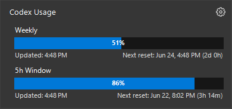

# Codex Usage Tray

Windows tray utility for monitoring Codex usage limits.

Clicking the tray percentage opens a compact usage panel with weekly and 5h window remaining usage, last update time, and reset timing:

## Download

Download the latest `CodexUsageTray.exe` from the [GitHub releases page](https://github.com/jeremygold02/codex-usage-tray-icon/releases/latest).

## Notes

- The tray icon always shows the selected remaining-usage percentage.
- The settings window lets you choose whether the tray percentage reflects weekly or 5h remaining usage.
