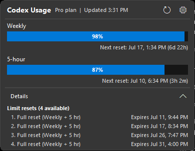
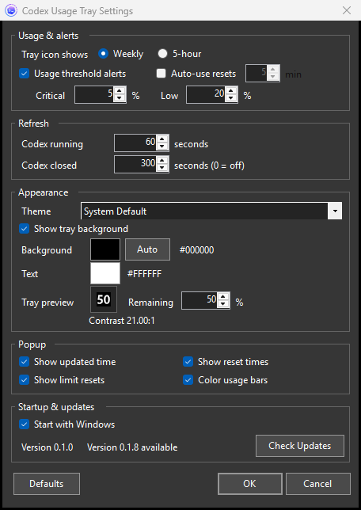

# Codex Usage Tray

Codex Usage Tray is a Windows tray utility for monitoring the usage limits of the account signed in to the Codex CLI. The tray icon shows the selected remaining-usage percentage, and a left-click opens a compact popup with the available weekly and 5-hour remaining usage, last update time, and reset timing.

## Requirements

- Windows.
- A Windows-accessible Codex CLI installation. Confirm it is available with `codex --version`.
- A Codex account signed in through the CLI for the same Windows user that runs the tray app. Run `codex login` before starting the app if needed.

The app looks for the standard npm Codex installation and then for `codex` on the Windows `PATH`. It does not provide a separate sign-in flow.

## Download

Download the latest `CodexUsageTray.exe` from the [GitHub releases page](https://github.com/jeremygold02/codex-usage-tray-icon/releases/latest).

## How usage is read

Each refresh starts a short-lived local `codex app-server --stdio` process and reads the signed-in account's rate-limit data directly. The tray app does not submit a prompt or make a synthetic model request to obtain usage data.

## Popup and details

The popup opens in its compact state and shows each primary weekly or 5-hour limit returned by Codex. Temporarily unavailable windows are hidden; if neither window is returned, the refresh fails with a clear status instead of displaying unknown values. A status line also appears while refreshing or when automatic checks are paused.

When the account response includes reset credits, a `Limit resets` control appears. Expand it to see:

- Available reset credits, including their titles and local expiration date/time when supplied by Codex.

The related Settings options can hide reset availability, reset times, or last-updated times. Limit resets are collapsed again the next time the popup opens.

## Refresh and settings

- Use the popup refresh icon or **Refresh now** in the tray menu for an immediate check. The refresh control is disabled while a check is already running.
- Automatic refresh defaults to every 300 seconds while Codex is running and can be set from 30 to 3600 seconds.
- Idle refresh defaults to off. When no Codex process is running, automatic checks pause unless an idle interval is configured; manual refresh remains available.
- A failed refresh keeps the last successful values visible and marks them as stale instead of replacing them with empty data.
- Open Settings from the popup gear or tray menu. Changes are saved only when **OK** is selected and immediately update the icon, popup, notifications, startup behavior, and refresh schedule as applicable.
- Settings also provides theme and tray appearance controls, threshold notifications, popup visibility options, Windows startup, and update checks.

## Troubleshooting

- **Codex CLI was not found:** verify `codex --version` in Windows, install or add the CLI to `PATH`, then restart the tray app so it inherits the updated environment.
- **Codex is not signed in:** run `codex login` as the same Windows user, then refresh again.
- **App-server errors or timeouts:** update the Codex CLI, confirm it starts normally, and retry from the popup. The last successful snapshot remains visible after a failed refresh.
- **No weekly or 5-hour limits returned:** retry the refresh and update the Codex CLI if the error persists. The app treats auxiliary model limits as supplemental data, not a replacement for the account's primary limits.
- **Waiting for Codex / checks paused:** start Codex, use manual refresh, or configure an idle refresh interval in Settings.
- **Reset expiration details are missing:** those rows appear only when Codex returns the corresponding account data and the related popup option is enabled.

## Privacy

Codex credentials remain managed by the Codex CLI; the tray app does not copy or store them. Usage snapshots are kept in memory, while app preferences are stored locally in `%APPDATA%\CodexUsageTray\settings.json`.

The Codex CLI contacts OpenAI for the authenticated rate-limit read. The tray app also contacts GitHub to check for releases and, when requested, download an update. It has no separate telemetry or analytics path and does not send prompts or synthetic model requests.

## Attribution

Codex Usage Tray is inspired by the tray display style of [Bluetooth Battery Monitor](https://www.bluetoothgoodies.com/) from Luculent Systems, LLC.

Bluetooth Battery Monitor is © 2017-2026 Luculent Systems, LLC. All Rights Reserved.
