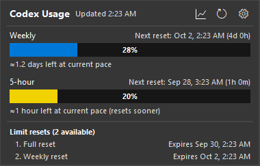
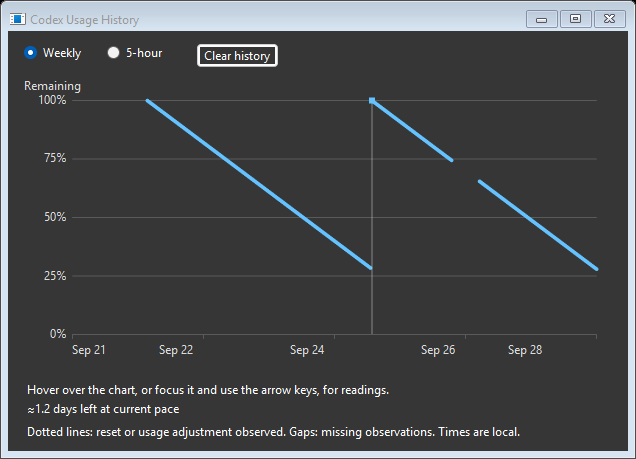
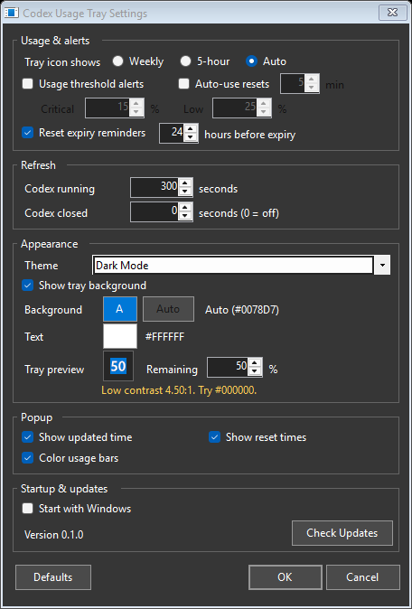

# Codex Usage Tray

Codex Usage Tray is a Windows tray utility for monitoring the usage limits of the account signed in to the Codex CLI. The tray icon shows the selected remaining-usage percentage, and a left-click opens a compact popup with weekly and 5-hour remaining usage, estimated time until depletion, and reset timing.



_Usage values and reset dates shown above are sample data._

## Requirements

- Windows.
- A Windows-accessible Codex CLI installation. Confirm it is available with `codex --version`.
- A Codex account signed in through the CLI for the same Windows user that runs the tray app. Run `codex login` before starting the app if needed.

The app looks for the standard npm Codex installation and then for `codex` on the Windows `PATH`. It does not provide a separate sign-in flow.

## Download

Download the latest `CodexUsageTray.exe` from the [GitHub releases page](https://github.com/jeremygold02/codex-usage-tray-icon/releases/latest).

## How usage is read

Each refresh starts a short-lived local `codex app-server --stdio` process and reads the signed-in account's rate-limit data directly. The tray app does not submit a prompt or make a synthetic model request to obtain usage data.

## Optional Claude support

Claude appears only when the native Windows Claude CLI is signed in and the tray app has a valid quota reading from the last 30 minutes. Otherwise, the popup and tray menu show no Claude controls or error placeholders. The tray icon and notifications continue to represent Codex.

To connect Claude, use Claude Code **v2.1.251 or later**, sign in with your Claude subscription, and configure its [status-line command](https://code.claude.com/docs/en/statusline) to send readings to this executable. For example, merge this property into `%USERPROFILE%\.claude\settings.json`, replacing the executable path with your actual location:

```json
{
  "statusLine": {
    "type": "command",
    "command": "\"C:/Tools/CodexUsageTray.exe\" --claude-statusline"
  }
}
```

This command captures usage silently. If you already have a status-line command, preserve it and use a wrapper that passes the same stdin to both commands instead of replacing it. The tray app does not edit Claude settings or read login credentials.

- Start a normal CLI session and use it. Claude supplies `rate_limits` after an API response for supported subscription accounts; signing in alone is insufficient. The collector never sends a prompt to obtain readings.
- When data becomes available, click the provider name in the popup header to switch between **Codex** and **Claude**. The chart button opens the selected provider's history. A **Claude usage history** tray-menu item also appears.
- Claude uses the same pace estimates and charts, with separate history in `claude-usage-history.json`. Clear that history after switching Claude accounts. Only quota percentages, reset times, and observation timestamps are saved in `claude-usage.json` and history.
- The app checks the local feed and CLI authentication every 30 seconds when a fresh feed exists, independently of Codex activity. Claude's refresh button reloads the latest feed; it does not query the account for a new reading. Expired windows are hidden independently. Missing, invalid, stale, or unauthenticated data hides Claude completely.
- Native `claude.exe` is discovered in `%USERPROFILE%\.local\bin` or on `PATH`. Restart the tray app after installing the CLI or changing `PATH`.

Claude Desktop and CLI share account allowances, but **Desktop sign-in alone does not enable this integration**. Desktop's Code tab is not guaranteed to run CLI status-line commands. This integration requires the CLI feed; it does not scrape Desktop or poll an undocumented account endpoint.

## Popup and details

The popup shows each primary weekly or 5-hour limit returned by Codex. Temporarily unavailable windows are hidden; if neither window is returned, the refresh fails with a clear status instead of displaying unknown values. A status line also appears while refreshing or when automatic checks are paused.

Available banked resets are always listed directly below usage, with their count, titles, and local expiration dates when supplied by Codex. There is no collapse control or setting to hide them. The section is absent when no resets are available. Settings can still hide usage reset times or last-updated times.

## Estimates and history

- Each usage bar has an approximate time remaining **at current pace**, calculated as remaining allowance divided by observed consumption per hour or day. For example, 80% remaining after using 20% over a day gives **≈4 days left at current pace**. The 5-hour estimate uses observations within the last hour; the weekly estimate uses up to 48 hours. Estimates assume that your observed pace continues.
- Recent-trend estimates need at least three observations spanning 15 minutes for the 5-hour window or six hours for the weekly window. Before that, the app uses the current window's percentage used divided by elapsed time since its inferred start (`reset time - window duration`), labeled **at cycle average**. For example, 20% used one day into a weekly window gives approximately four days remaining immediately. This initial pacing follows the approach in [OpenQuota](https://github.com/deviffyy/OpenQuota/blob/main/src-tauri/src/pacing.rs).
- The cycle-average estimate waits until at least 1% of the window (and at least one minute) has elapsed, needs known window/reset timing, and is suppressed after an observed usage decrease within the same reset window. When neither method has enough information, the popup shows **Learning usage pace...**. Recent observed trends take precedence once available.
- When the allowance is projected to last until or beyond its scheduled reset, the estimate shows **Will last until reset**. Otherwise, it shows the estimated time remaining. This applies to both recent trends and cycle averages. No observed increase is reported explicitly rather than inventing a depletion time.
- Failed, paused, or more than 30-minute-old readings do not produce current estimates. Observed usage decreases or changed reset deadlines start a new forecast segment. Weekly estimates can span overnight gaps only when both observations share a known reset deadline.
- Open **Usage history** from the tray menu or the chart icon beside Refresh. Weekly and 5-hour select the usage limit; both show all retained readings for that limit, starting at its earliest recorded reading. Move or drag across the chart to snap a vertical guide to the nearest recorded point. The footer shows its local timestamp, remaining percentage, and used percentage; leaving the chart restores the latest reading. Arrow keys also select readings, without a dotted focus border.
- Readings are connected with a blue line. Dashed segments span gaps over two hours; they connect observations without implying measurements were taken in between. Reset or usage-adjustment boundaries remain disconnected and have vertical dotted markers at the observation time. Only endpoints, resets, and the selected reading are emphasized with point markers.
- When a valid estimate and reset deadline are available, an amber dashed **Projected** line extends from the latest recorded reading to the reset or to zero remaining, whichever comes first. The time axis expands to include it, and the forecast text stays beneath the stats. This projection uses the same consumption rate as the estimate; it is not recorded history, and the selection guide never selects projected values. Stale or insufficient data hides the projection.
- Successful readings are saved locally in `%APPDATA%\CodexUsageTray\usage-history.json`, retaining up to 14 days and 45,000 observations. After the first successful Codex refresh, a background scan backfills quota readings from existing local `sessions` and `archived_sessions` logs under `CODEX_HOME` (or `%USERPROFILE%\.codex`). Only valid account-quota events matching the current reset deadlines are imported; token counts are never converted into invented quota percentages. Missing logs or unsupported formats simply leave less history available.
- Import scans recent files first, stopping after 30 seconds or 1 GiB, so very large log collections can yield partial history. It runs once and records completion in `usage-history.json.imported`. Use **Clear history** to erase saved readings, including after switching Codex accounts: history belongs to the Windows user and is not separated by account. Clearing also prevents the background import from restoring erased readings. Source session logs remain untouched.



_The history chart above uses sample data._

## Refresh and settings

- Use the popup refresh icon or **Refresh now** in the tray menu for an immediate check. The refresh control is disabled while a check is already running.
- Automatic refresh defaults to every 300 seconds while Codex is running and can be set from 30 to 3600 seconds.
- Idle refresh defaults to off. When no Codex process is running, automatic checks pause unless an idle interval is configured; manual refresh remains available.
- A failed refresh keeps the last successful values visible and marks them as stale instead of replacing them with empty data.
- The first successful refresh that observes a weekly or 5-hour limit return to 100% shows one reset notification. Startup-at-100, stale refreshes, and brief 99%-to-100% jitter do not produce duplicate alerts.
- The app caches the last observed banked resets in `%APPDATA%\\CodexUsageTray\\banked-reset-state.json` and shows a tray notification whenever a new one becomes available, including resets added while the app was closed. The first refresh without an existing cache establishes a baseline quietly.
- **Reset expiry reminders** defaults to 24 hours before expiration and can be disabled or set from 1 to 72 hours. Each itemized credit with a known expiration produces one reminder, independent of **Auto-use resets**. The app checks once at startup and revalidates known credits when their reminder becomes due, including while idle checks are paused. Notification state is saved in `reset-reminders.json` to avoid repeats after restart. The app must be running and able to refresh to deliver a reminder.
- **Tray icon shows → Auto** selects whichever available limit has the lower remaining percentage, preferring weekly on a tie. The tooltip identifies the selected limit. Explicit Weekly and 5-hour choices remain available.
- **Auto-use resets** is opt-in and disabled by default. When enabled, the app can redeem an itemized Codex reset credit shortly before expiration, defaulting to five minutes, only when there is usage to reset. Redemption attempts use persisted idempotency state to prevent duplicates.
- Open Settings from the popup gear or tray menu. Changes are saved only when **OK** is selected and immediately update the icon, popup, notifications, startup behavior, and refresh schedule as applicable.
- Settings also provides theme and tray appearance controls, threshold notifications, popup visibility options, Windows startup, and update checks.



## Troubleshooting

- **Codex CLI was not found:** verify `codex --version` in Windows, install or add the CLI to `PATH`, then restart the tray app so it inherits the updated environment.
- **Codex is not signed in:** run `codex login` as the same Windows user, then refresh again.
- **App-server errors or timeouts:** update the Codex CLI, confirm it starts normally, and retry from the popup. The last successful snapshot remains visible after a failed refresh.
- **No weekly or 5-hour limits returned:** retry the refresh and update the Codex CLI if the error persists. The app treats auxiliary model limits as supplemental data, not a replacement for the account's primary limits.
- **Waiting for Codex / checks paused:** start Codex, use manual refresh, or configure an idle refresh interval in Settings.
- **Reset expiration details are missing:** those rows appear only when Codex returns the corresponding account data and the related popup option is enabled.

## Privacy

Codex credentials remain managed by the Codex CLI; the tray app does not copy or store them. Usage history stores local timestamps, usage percentages, and reset timing. Preferences, history, and notification state are saved locally under `%APPDATA%\CodexUsageTray`; history contains no prompts or conversation content and can be cleared from its window.

The Codex CLI contacts OpenAI for authenticated rate-limit reads and, when **Auto-use resets** is enabled, supported reset-credit redemption requests. The tray app also contacts GitHub to check for releases and, when requested, download an update. It has no separate telemetry or analytics path and does not send prompts or synthetic model requests.

## Attribution

Codex Usage Tray is inspired by the tray display style of [Bluetooth Battery Monitor](https://www.bluetoothgoodies.com/) from Luculent Systems, LLC.

Bluetooth Battery Monitor is © 2017-2026 Luculent Systems, LLC. All Rights Reserved.
